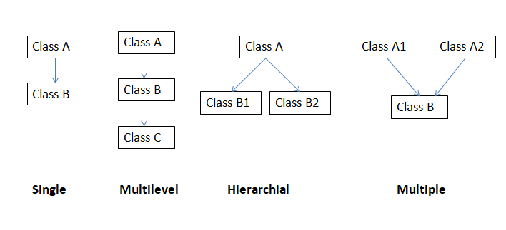

# Object-Oriented-Programming in Python:
**Object Oriented Programming:** It is a methodology to design a program using classes and objects.      

**Class:** It is a logical entity which is a blueprint/template that describes the details of an object.

**Object:** It is a real-word entity which is an instance of the class.             

**Empty class:** An empty class can be created using pass keyword.           

**Constructor:** It is a special method that is used to initialize an object and allocate memory to it. __init__() is a constructor in python
    An object cannot be created without a constructor. If we don't define it, python defines it.   
    **Two types:**      
    - **Default Constructor:** Constructor that doesn't accept any arguments during the object creation.    
    - **Parameterized:** Constructor that accepts arguments during the object creation.
    
**Self:** It is a pointer that points to the object of the class
  - In __init__() method, it refers to the newly created object. In other methods, it refers to the object whose method was called.

# Features of OOPs:
  - Inheritance
  - Polymorphism
  - Abstraction
  - Encapsulation
  
### Inheritance:
It is a way of creating a new class using the details of an existing class without modifying it.
New class is called as a child/derived class and the existing class is called as a parent/super class.

#### Types:
- **Single Inheritance:** Class inherits only one super class
- **Multilevel Inheritance:** Class which inherits a super class will be inherited by another class forming a parent,child and grandchild relationship.
- **Hierarchial Inheritance:** Super class will be inherited by multiple derived classes
- **Multiple Inheritance:** Class inherits multiple super classes
- **Hybrid Inheritance:** It is a combination of Multilevel and Multiple inheritance.

